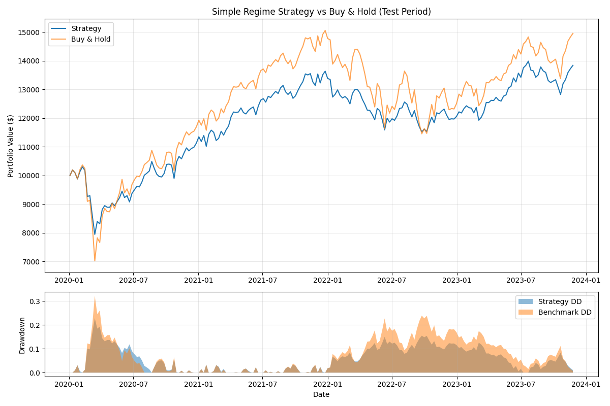

# Market Regime Prediction

A machine learning project that attempts to predict market regimes (bull/neutral/bear) using Hidden Markov Models and Random Forest classifiers.

The inspiration was a paper from NYU quant research competition, team Alpha (original name, congrats) who won I believe first place. I was reverse engineering it to the last detail. What I found was beautiful - basically the paper has a MASSIVE look-ahead bias. I was able to replicate those fantastic results but only when I would allow the models to see into next week. After correctly accounting for this, results are pretty bad and also non-deterministic even though I tried to stabilize the models.

There were a few other issues, like the ORACLE labeling is somewhat logically inaccurate, since by adjusting the labels - we are training supervised models on labels that inherently have look-ahead bias. Although in the paper I defend this opinion and I don't think it is highly crucial.

But overall it is definitely a nice exercise and a good cold shower. Something looks too good to be true? (also is made by students?) - boy it IS too good to be true.

## Papers

- [My paper on this project](machine-learning-approach-to-labeling-and-predicting-the-stock-market-1-1.pdf)
- [NYU Team Alpha's original paper](NYU%20Tandon_Team%20Alpha.pdf)

--

Later I added simple model that is logically more correct and without fancy stuff like multiple models, etc. The results are also mediocre. I trained it on 4 indicators, each with 3 sets of parameters, no hyperoptimization. 

So why doesn't it work? Why couldn't NYU Alpha team predict that 2020 crash?

1. Weekly data, prediction on entire stock market - that's macro stuff. You can't predict macro with RSI
2. Covid crash happened from a low vol environment and without any prior warning price wise. The bounceback was incredibly fast, but volatility consistent with the fall, therefore it really is not possible to predict nor the beginning of the fall or the beginning of the bounce-back using a single model, just on the price. If model can predict the fall, then it should be so sensitive, that very single 0.5% fall in the stock market will be labelled as a bear market. And similarly, if model can predict the bounce back, then it should label every single up day, following a drawdown, as bull, which will generate many losses. Therefore knowing the model AND the performance of it, I can surely say such models suck for macro level trading

Future: What if we try this with macro data? Download 100 indicators from FRED, run them throgh. Could macro data predict it? (spoiler alert: it probably won't but a possible direction for testing)

## Project Structure

```
├── Market_State_Model/     # Original implementation (fancy stuff)
├── Simple_Model/           # Clean rewrite with proper methodology
│   ├── data_loader.py      # Fetches SPY data, calculates indicators
│   ├── backtest.py         # Backtesting engine with proper timing
│   └── run.py              # Main pipeline
└── README.md
```

### How It Works

1. **Data**: Weekly SPY prices (2000-2023) with technical indicators
   - Mean reversion: RSI, Stochastic
   - Trend: Momentum, MACD

2. **Unsupervised Learning**: HMM identifies 3 hidden states in training data (2000-2017)

3. **State Mapping**: States are labeled as BULL/NEUTRAL/BEAR based on average returns

4. **Supervised Learning**: Random Forest learns to predict next week's regime from current indicators

5. **Backtesting**: Test on held-out data (2020-2023) with position sizing:
   - BULL: 100% invested
   - NEUTRAL: 80% invested
   - BEAR: 50% invested

### Results

Simple model returns:



The strategy underperforms on raw returns but achieves ~8% lower maximum drawdown.

### Running

```bash
cd Simple_Model
pip install numpy pandas yfinance scikit-learn hmmlearn matplotlib
python run.py
```
